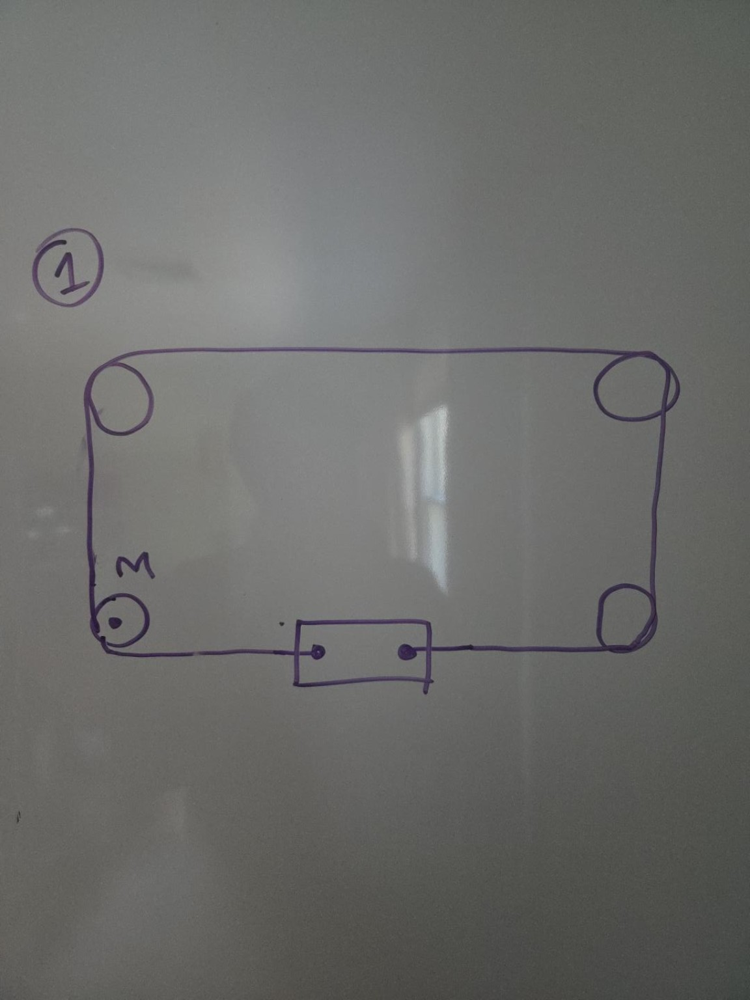
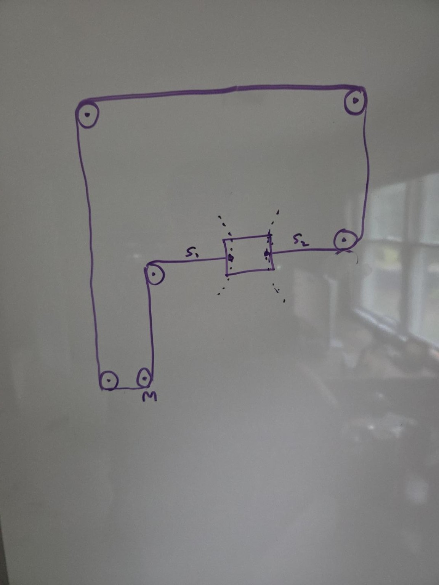

# CoreXY Interactive Explainer — Handoff Document

## Project Goal

Build an interactive HTML/SVG explainer for the mechanics of a CoreXY motion system.

The key objective is **not** to start with a finished CoreXY belt routing and then explain what the motors do. Instead, the experience should **derive the CoreXY idea incrementally from simple belt-length constraints**, so that the reader discovers why the mechanism creates two diagonal coordinates.

The intended experience is closer to an **interactive kinematics laboratory** than a conventional article or video.

The user should be able to manipulate the available degrees of freedom at each stage and directly observe how an idealized inextensible belt constrains the mechanism.

---

# Core Conceptual Motivation

A common source of confusion with CoreXY is this:

> How can a single motor, combined with a belt and a gantry that can move vertically, produce a diagonal motion constraint?

Most CoreXY explanations jump directly to statements like:

- motor A corresponds to one diagonal
- motor B corresponds to the opposite diagonal
- same-direction motor motion gives one Cartesian axis
- opposite-direction motor motion gives the other Cartesian axis

Those statements are correct, but they can feel arbitrary or magical if the viewer has not first understood **where the diagonal coordinates come from mechanically**.

The explainer should therefore build toward the idea that:

> A single belt-and-motor subsystem creates a **movable virtual 45-degree guide**.

With one motor position fixed, the carriage is constrained to a diagonal line such as

\[
x + y = C
\]

The motor does **not** move the carriage along that diagonal. Instead, motor rotation changes \(C\), which translates the entire allowed diagonal.

A mirrored second belt/motor subsystem creates the complementary constraint:

\[
x - y = D
\]

The carriage position is the intersection of those two virtual diagonal guides.

This makes the usual CoreXY coordinate transform intuitive:

\[
x + y = A
\]

\[
x - y = B
\]

so that

\[
x = \frac{A+B}{2}, \qquad y = \frac{A-B}{2}
\]

where \(A\) and \(B\) are actuator coordinates proportional to belt displacement / motor rotation.

---

# Pedagogical Strategy

The page should reveal the mechanism in stages.

The same visual scene should ideally **morph from one stage into the next** instead of presenting disconnected diagrams.

The key principle is:

> Change one assumption at a time.

Every transition should make it obvious what changed and what did not.

---

# Important Simplifying Assumption

The mechanism is intentionally idealized.

Use wording similar to:

> “For now, assume the belt is perfectly inextensible — a bit of a spherical-cow assumption. In a real machine, the carriage would normally need a linear guide, but this idealization lets us focus purely on the belt-length constraints.”

This idealization is important because the visual explanation should avoid introducing a physical linear rail at the beginning only to remove it immediately afterward.

In the simplified model:

- belt segments are perfectly inextensible
- belt does not sag
- belt remains taut
- pulleys are ideal
- no backlash
- no belt tooth deformation
- no bearing compliance
- carriage attachment points are rigidly clamped to the belt
- only the explicitly enabled degrees of freedom are allowed

The real-world limitations can be discussed later.

---


# Reference Sketches from the Design Discussion

Use the following hand-drawn sketches as the grounding references for the first two belt layouts. They are intentionally rough; preserve their **topology and conceptual role**, not their exact proportions.

## Sketch A — Initial simple X-motion stage



This is the reference for **Stage 0**. It shows:

- one motor at the lower-left
- three passive idlers completing a roughly rectangular closed loop
- a horizontal lower belt run
- the carriage clamped to that lower horizontal run
- all pulley centers fixed to ground

The polished SVG does not need to copy the hand drawing literally, but it should preserve the obvious visual idea: this is just an ordinary belt-driven horizontal linear motion system.

## Sketch B — Rearranged belt routing



This is the reference for the **rearrangement after the initial X-motion stage**. Important features are:

- the belt is still one continuous closed loop
- the motor remains ground-mounted
- the carriage is still attached between two horizontally separated belt-routing points
- the left and right idlers adjacent to the carriage establish the horizontal belt stretch
- additional fixed idlers route the remainder of the belt around the frame
- at this stage, **all idlers are still fixed**, so the mechanism must first be re-animated to demonstrate that it remains ordinary horizontal linear motion

Only after that familiar-motion check should the selected horizontally separated idlers be unlocked to move together in \(Y\).

The implementation should make the transition from Sketch A to Sketch B visually continuous: pulleys move to their new locations, the belt reroutes smoothly, and the viewer can still recognize it as the same belt/motor/carriage system.


# High-Level Storyline

## Stage 0 — Familiar belt-driven linear motion

Start from the simplest recognizable mechanism:

- one motor
- a closed-loop belt
- several fixed idler pulleys
- one small carriage attached to a straight horizontal portion of the belt

All idlers are fixed.

Motor rotation moves the belt.

The carriage follows the straight horizontal belt section.

At this stage the behavior should feel completely ordinary:

> motor rotation → horizontal linear motion

The viewer should see this interactively before anything more complex is introduced.

### Important visual note

Do **not** add a physical linear rail in the drawing.

The explanatory caveat about a perfectly inextensible belt is sufficient.

The purpose is to treat the belt itself as an ideal kinematic constraint.

---

## Stage 1 — Fixed idlers are only routing elements

Explain that the exact number or arrangement of fixed idlers is not special.

Suggested narration / text:

> “We used three idlers here, but there is nothing special about three. Fixed idlers mostly just let us route the belt where we want it.”

The belt can wrap around an arbitrary number of fixed idlers, as long as the relevant topology remains useful.

This gives permission to rearrange the routing.

---

## Stage 2 — Rearrange the idlers

Animate the fixed pulleys into a new topology that will later support the diagonal-motion insight.

The rearrangement should be smooth and obviously preserve the same closed belt.

Important: **do not unlock any new degree of freedom yet**.

After the rearrangement, everything should still be fixed except:

- motor rotation
- carriage horizontal motion

---

## Stage 3 — Re-animate ordinary horizontal motion

This beat is important.

Before proceeding to the clever part, re-run the motor.

Suggested text:

> “The belt path looks more complicated now, but mechanically nothing fundamental has changed.”

Then let the viewer move the motor again.

The carriage should still move purely horizontally.

This reassures the reader that the rearrangement itself was not the trick.

The sequence should feel intentionally boring here.

---

## Stage 4 — Unlock vertical motion of a selected idler pair

Now make exactly one change.

A selected pair of horizontally separated idlers is no longer fixed to ground.

They are constrained to move together vertically.

Visually show the transition from something like:

- fixed / locked

to:

- free in Y

The motor should initially remain locked.

Invite the viewer to drag the idler pair up or down.

Because the belt is inextensible, vertical motion of the idler pair forces horizontal carriage displacement.

This produces a coupled motion.

The resulting remaining degree of freedom is diagonal.

This is the main conceptual “aha” moment.

---

## Stage 5 — Reveal the diagonal constraint

Once the viewer has explored the coupled motion, overlay the corresponding diagonal line.

For a chosen sign convention, something like:

\[
x + y = C
\]

The exact sign is not important as long as it is internally consistent with the chosen belt routing.

At fixed motor position:

- the carriage may move along the diagonal
- the mechanism has one remaining degree of freedom

This should be interpreted as:

> the entire belt subsystem behaves like a virtual 45-degree linear guide

This is the core abstraction.

---

## Stage 6 — Show that motor rotation translates the diagonal

Now allow the motor to move again.

The key conceptual distinction:

> The motor does not push the carriage along the free diagonal.

Instead:

> The motor changes the offset of the diagonal constraint itself.

That is, motor rotation changes \(C\):

\[
x + y = C_1
\]

becomes

\[
x + y = C_2
\]

So the virtual diagonal guide translates perpendicular to itself.

A particularly effective visual would be:

1. fade the belt slightly
2. draw the virtual diagonal guide prominently
3. rotate the motor
4. animate the diagonal guide sliding parallel to itself

The carriage remains free along that line.

---

## Stage 7 — Add the mirrored second belt subsystem

Introduce a second motor/belt system that creates the opposite diagonal constraint.

For example:

\[
x + y = A
\]

and

\[
x - y = B
\]

Now the carriage is constrained to the intersection of two moving virtual diagonal guides.

The viewer should be able to manipulate Motor A and Motor B independently.

Moving one motor translates one diagonal.

Moving the other translates the other diagonal.

The carriage follows the intersection.

---

## Stage 8 — Discover Cartesian motion

Do not immediately explain the standard CoreXY motor combinations.

Let the viewer discover them.

Prompts could include:

> “Try moving both motors together.”

and

> “Try moving them in opposite directions.”

Then optionally add buttons:

- Motor A only
- Motor B only
- Pure X
- Pure Y

Finally reveal:

\[
x = \frac{A+B}{2}
\]

\[
y = \frac{A-B}{2}
\]

The equations should feel like a compact description of something the user already understands geometrically.

---

# Why the Initial Rectangular Belt Routing Must Be Rearranged

The initial simple belt-driven layout is good for teaching ordinary linear motion.

However, it is **not automatically suitable** for the later moving-idler trick.

If one simply takes arbitrary pulleys from the first layout and allows them to translate vertically together, the belt-length changes may not couple to carriage motion in the desired way.

For example, the moving pulley pair may add belt length symmetrically while horizontal carriage motion merely transfers belt length from one side to the other with zero net compensation.

Therefore the rearrangement stage has a specific purpose:

> Arrange the belt so that vertical motion of the selected pulley pair changes belt length in a way that horizontal carriage displacement can compensate.

This distinction should be preserved in the implementation and explanation.

---

# Core Visual Language

The visual design should be simple, geometric, and engineering-oriented.

Avoid photorealism.

Use SVG.

The mechanism should read as a clean kinematic diagram.

## Belt

- thick continuous stroke
- smooth rounded corners / pulley wraps
- strong contrast against the background
- belt should remain visually continuous through all stages

## Belt motion markers

This is extremely important.

Add discrete tracer markers “painted” onto the belt.

Purpose:

- make belt material motion obvious
- show that the belt circulates continuously
- visually distinguish belt motion from carriage motion
- reinforce that the same belt remains continuous through routing changes

### Marker design

- small dots or short dashes
- visually sparse
- roughly equivalent to at least ~1 cm apart at the intended rendered scale
- avoid dense spacing that makes them look like texture
- avoid spacing so tight that video/display antialiasing causes shimmer

In the first prototype, marker spacing was increased from ~72 SVG units to around ~92–96 units.

The exact value should scale with the final SVG geometry.

### Marker animation

Markers should be parameterized by arc length along the belt path.

Conceptually:

\[
s_i(t) = (s_i(0) + d(t)) \bmod L
\]

where:

- \(s_i\) is marker position along belt arc length
- \(d(t)\) is accumulated belt travel
- \(L\) is total belt path length

When the belt geometry deforms later, the markers should continue to behave like material points on the belt.

---

# Pulley Visuals

Each pulley should have:

- outer circle
- center / bearing indication
- a radial spoke or tick mark

The radial spoke should rotate with belt motion so pulley rotation is visually obvious.

Motor pulley should be visually distinct from passive idlers.

Suggested distinction:

- motor uses a stronger accent ring
- idlers remain more neutral

---

# Carriage Visuals

The carriage should be a compact rectangular platform.

It should be visually centered on the relevant belt run.

Earlier prototype issue:

- carriage looked slightly misaligned
- attachment blocks looked like arbitrary floating purple squares

Correct approach:

- carriage body sits just below the belt
- two belt clamps visibly straddle the belt line
- clamp geometry should read clearly as a mechanical attachment to the belt

Example conceptual layout:

```text
---------------- belt ----------------

      [clamp]      [clamp]
        |             |
     +-------------------+
     |     carriage      |
     +-------------------+
```

The clamps should not look decorative.

---

# Interaction Language

The user should be able to manipulate only the degrees of freedom currently available in that stage.

Visual cues should make interactive elements obvious.

Examples:

## Motor

Provide either:

- rotational drag handle
- horizontal slider
- both

A slider is useful for accessibility and precise control.

## Moving idler assembly

When the idler pair becomes vertically movable:

- add a vertical handle
- optionally add a faint vertical guide
- allow pointer drag
- also provide a slider or keyboard-accessible alternative

## Carriage

When carriage drag is useful:

- allow pointer drag
- project attempted motion onto the currently allowed kinematic constraint

For example:

- if only horizontal motion is allowed, drag maps to X
- if only diagonal motion is allowed, drag projects onto the diagonal

---

# Constraint Feedback

It may be helpful for forbidden motion to feel physically constrained.

For example:

- before the Y degree of freedom is unlocked, attempted vertical carriage drag should not move the carriage
- optionally provide a small visual resistance / snap-back effect

Do not overdo springiness or cartoon effects.

The interaction should remain mechanically credible.

---

# Stage Transitions

Transitions are central to the teaching strategy.

The same SVG scene should persist across stages.

Avoid hard cuts where possible.

Use smooth animations for:

- pulley relocation
- belt rerouting
- lock/unlock states
- appearance of virtual diagonal guides
- mirrored second subsystem

The viewer should always understand which physical objects are the same objects from the previous stage.

---

# Lock / Unlock Visual Language

When a pulley or assembly is fixed to ground:

- use a subtle lock icon, anchor symbol, or ground bracket
- keep visual language minimal

When unlocked for vertical motion:

- replace lock cue with vertical arrows or a track indication

The transition should make the newly available DOF very obvious.

---

# Suggested Layout

Desktop:

```text
+------------------------------------------------------+
| Short explanation / current stage                   |
+------------------------------------------------------+

+------------------------------------------------------+
|                                                      |
|                   Main SVG mechanism                 |
|                                                      |
+------------------------------------------------------+

+------------------------------------------------------+
| Motor slider        | Play | Reset | Stage controls |
+------------------------------------------------------+

Short contextual explanation / equation
```

On narrow screens:

- stack controls vertically
- keep SVG aspect ratio intact
- avoid horizontal page scrolling

---

# Recommended Technical Approach

## Stack

Use plain:

- HTML
- CSS
- SVG
- vanilla JavaScript

No framework is necessary initially.

The experience should remain portable as a standalone HTML file.

A framework can be introduced later only if the state machine becomes unwieldy.

---

# Suggested Internal Model

Do not directly hard-code every SVG transform independently.

Create a small kinematic model.

Potential state structure:

```js
const state = {
  stage: 0,

  motorA: 0,
  motorB: 0,

  gantryY: 0,
  carriageX: 0,
  carriageY: 0,

  beltTravelA: 0,
  beltTravelB: 0,
};
```

Then derive geometry from state.

The exact variables will evolve as stages are implemented.

---

# Belt Geometry

Ideally represent each belt as a sequence of:

- straight tangent segments
- circular pulley arcs

Later, when idlers move, recompute geometry from pulley centers.

The first prototype used a fixed SVG `<path>` and browser methods:

```js
path.getTotalLength()
path.getPointAtLength(s)
```

This is perfectly acceptable for Stage 0.

For later stages, if the belt path must deform dynamically, either:

1. dynamically rebuild the SVG path and continue using `getTotalLength()` / `getPointAtLength()`, or
2. maintain an explicit geometric representation of lines and arcs and sample arc length manually

Option 1 is simpler initially.

---

# Belt-Length Constraints

The implementation should reflect the actual idealized belt constraint rather than merely animating the carriage visually.

At each stage, derive allowed positions from constant belt length.

For the diagonal stage, the geometry should naturally reduce to a constraint of the form:

\[
x \pm y = C
\]

Do not fake the diagonal by directly assigning:

```js
x = t;
y = t;
```

unless that is merely the final rendering step after deriving the correct scalar constraint.

The educational strength comes from the mechanism actually obeying the constraint model.

---

# Accessibility

All drag interactions need non-drag alternatives.

Provide:

- range inputs for motor position
- range input for movable idler Y
- keyboard-focusable buttons

SVG should have:

- `role="img"`
- useful `aria-label`

Dynamic explanatory text should use an `aria-live` region if appropriate.

Respect:

```css
@media (prefers-reduced-motion: reduce)
```

Automatic animation can be disabled while preserving manual controls.

---

# Stage Navigation

Possible UI:

```text
← Back     Step 2 of 8     Next →
```

Or a compact stage list:

```text
1 Linear belt
2 Rearrange
3 Still linear
4 Unlock Y
5 Diagonal guide
6 Move guide
7 Add second guide
8 CoreXY
```

Avoid exposing all later concepts too early if that spoils the discovery.

A simple Next button is probably best initially.

---

# Interaction Philosophy

Do not make the page feel like a slide deck.

At each stage, give the user something meaningful to manipulate.

Examples:

### Stage 0

“Turn the motor.”

### Stage 3

“Try it again. Nothing fundamental changed.”

### Stage 4

“Keep the motor fixed. Drag these pulleys vertically.”

### Stage 5

“Try moving the carriage. Notice the direction in which it is free.”

### Stage 6

“Now rotate the motor. What happens to the allowed diagonal?”

### Stage 8

“Try moving both motors together.”

The page should encourage physical intuition before showing formulas.

---

# Formula Presentation

Keep math minimal until the corresponding geometry is already visually obvious.

Do not begin with:

\[
x = \frac{A+B}{2}
\]

That should appear near the end.

Earlier equations should describe the currently visible constraint.

For example:

\[
x+y=C
\]

Overlay this directly next to the virtual guide.

As the motor moves, animate the value of \(C\) if useful.

---

# Possible Advanced Visualization

Once the diagonal stage is established:

- fade belt/pulleys slightly
- draw the virtual diagonal guide prominently
- perhaps animate a morph between the mechanical belt representation and the abstract guide

The ideal visual takeaway is:

```text
physical belt constraint
        ↓
virtual diagonal guide
        ↓
two diagonal guides
        ↓
CoreXY
```

---

# Optional Real-World Epilogue

After the main explanation, add a short note:

> “The diagonal-coordinate idea is not inherently about belts. The belt is simply a lightweight way to implement these constraints.”

This can connect to the idea of implementing the same kinematic transform with:

- rigid links
- linear rails
- ball screws
- other ground-mounted actuators

This observation is useful because it reinforces that CoreXY is fundamentally a **coordinate transform / kinematic architecture**, not merely a specific belt routing.

Also note why belts are used:

- low moving mass
- motors remain stationary
- inexpensive
- mechanically simple

And why belts have limitations:

- compliance
- stretch
- tooth deformation
- tension sensitivity
- reduced stiffness compared with rigid screw-driven systems

This should remain an epilogue, not distract from the core explainer.

---

# Current Prototype Visual Decisions

The initial prototype already established several useful conventions.

## Background / style

- dark technical UI
- high-contrast belt
- colored carriage
- distinct motor accent
- sparse colored belt tracer dots

These are working well.

## Belt tracer spacing

Earlier version used:

```js
const markerSpacing = 72;
```

This looked too dense.

Updated direction:

```js
const markerSpacing = 92;
// or around 96
```

Markers should visually read as discrete painted marks.

## Carriage attachments

Earlier version placed two purple blocks above the carriage.

This was confusing.

Preferred geometry:

```html
<g id="carriage" transform="translate(360 335)">
  <rect x="-58" y="-4" width="116" height="50" rx="10" class="carriage"/>

  <rect x="-49" y="-12" width="16" height="24" rx="3" class="clamp"/>
  <rect x="33" y="-12" width="16" height="24" rx="3" class="clamp"/>

  <text x="0" y="20" text-anchor="middle" class="svg-label">
    carriage
  </text>
</g>
```

The two clamps straddle the belt line and clearly represent attachment points.

---

# Stage 0 Functional Requirements

The first implementation milestone should be a polished Stage 0.

Required behavior:

1. Show one motor and fixed idlers.
2. Show a continuous closed belt.
3. Show sparse tracer markers on the belt.
4. Show a carriage clamped to a horizontal belt segment.
5. Motor slider moves:
   - motor rotation
   - pulley rotation
   - belt tracers
   - carriage position
6. Play button oscillates motor automatically.
7. Pause works.
8. Reset returns to center.
9. Carriage is visually centered on the belt.
10. Clamp points clearly straddle the belt.
11. Layout works on desktop and mobile.
12. Reduced-motion preference disables autoplay but keeps manual control.

---

# Stage 0 Conceptual Text

Suggested copy:

## Heading

**Step 0 — ordinary belt-driven linear motion**

## Intro

> Assume an ideal, perfectly inextensible belt — a bit of a spherical-cow model. In a real machine, the carriage would normally need a linear guide, but this lets us focus purely on the belt kinematics.

## Prompt

> Turn the motor and watch what happens to the belt and carriage.

## Observation

> The motor advances the belt, and the carriage follows the horizontal belt run.

No CoreXY terminology is needed yet.

---

# Questions to Resolve During Implementation

1. What exact belt routing best supports the later movable-idler stage?
2. Which sign convention should be used for the first diagonal?
3. Should motor input be expressed in:
   - degrees
   - belt displacement
   - arbitrary normalized units
4. Should the user be able to drag the motor directly, or only use a slider?
5. Should the carriage be draggable in Stage 0?
6. Should forbidden motion visibly snap back?
7. Should pulley relocation be physically animated or cross-faded?
8. Should formulas be displayed persistently or only after discovery?
9. How much narration should be inline text versus tooltip/callout?
10. Should the final page be one standalone file or split into modules?

---

# Recommended Development Order

## Milestone 1

Polish Stage 0.

Focus on:

- SVG composition
- belt appearance
- markers
- pulley rotation
- carriage alignment
- interaction feel

Do not implement the later stages until the visual language feels right.

## Milestone 2

Implement idler rearrangement.

Ensure:

- smooth transition
- belt stays visibly continuous
- motor interaction still works afterward
- carriage still moves purely horizontally

## Milestone 3

Implement moving idler pair.

Solve belt geometry and constant-length constraint correctly.

Allow:

- vertical drag
- corresponding carriage response

## Milestone 4

Overlay virtual diagonal guide.

Allow drag along the constrained diagonal.

## Milestone 5

Allow motor to translate diagonal constraint.

## Milestone 6

Add mirrored second subsystem.

## Milestone 7

Add final CoreXY coordinate controls and equations.

## Milestone 8

Add optional real-world engineering epilogue.

---

# Main Design Principle

If there is one idea to preserve throughout implementation, it is this:

> Do not tell the reader that CoreXY uses diagonal coordinates. Let them discover the diagonal constraint by manipulating an ordinary belt mechanism.

The experience should make the final CoreXY equations feel inevitable.
